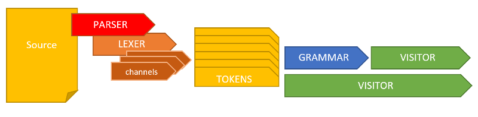
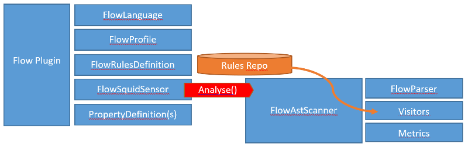

## DEVELOPMENT GUIDE

The project consits of 3 parts:

### sonar-flow-plugin

The main code which is the actual plugin. It is dependant on the sslr flow parser.

### sonar-flow-plugin-sslr

The code which contains the sslr flow parser. It contains the grammar definition of the flow language.

### sonar-flow-plugin-sslr-toolkit

The toolkit is a graphical tool which helps in visualizing the sslr parsing.

## SSLR Flow parsing

SonarSource Language Recognizer ([SSLR](http://docs.sonarqube.org/display/DEV/SSLR)) is a framework which provides a means to parse your code into an Abstract Syntax Tree (AST). The AST is a tree structure of nodes.

The FlowParser will use the FlowLexer. Normally a lexer has many channels to read many types of lines. Since we're reading a xml file, we're using only one channel: SaxChannel. The SaxChannel will consume the whole file and the Sax FlowContentHandler will create the AST nodes.

The output from the FlowLexer will be pseudo flow, pseudo xml:

	START_FLOW
		START_SEQUENCE
			...
		STOP_SEQUENCE
	STOP_FLOW

Next the Grammar steps in combining these AST nodes into higher level GrammarRuleKeys (which is a superset of AST node). So once the parser has finished building the grammar you end up with a tree of GrammarRuleKeys:

	FLOW
		SEQUENCE
			ATTRIBUTES
				...

## Sonar flow plugin

The sonar flow plugin makes use of the [sonar plugin capabilities](http://docs.sonarqube.org/display/DEV/Coding+a+Plugin). It contains identifiers for the sonar runtime components (e.g. scanner) to use its code to parse source code. It also contains the rules that can be added to quality profiles and that can trigger issues.

### Visitors and rules

Visitors are listeners that are invoked when the parser create an AST node for which the visitor is listening. Visitors allow you to buil up metrics, such as counting the number of invokes or map steps.
A special kind of visitors are rules. These visitors can create violations.
