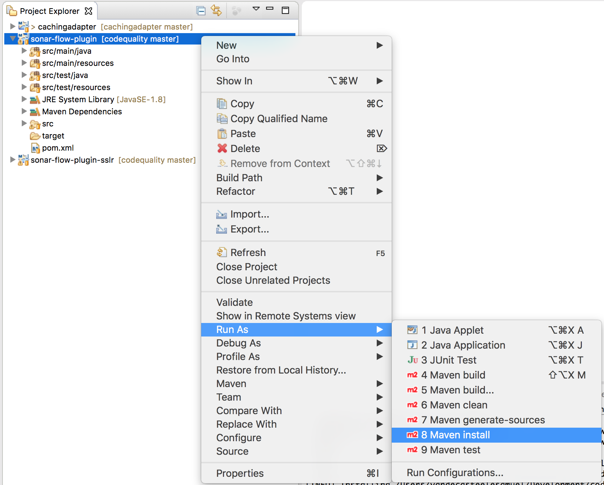

## DEVELOPMENT SETUP

### Get the source code
Clone the repository to your local machine.
```sh
git clone https://github.com/I8C/sonar-flow-plugin
```
Open eclipse and import the sonar-flows-plugin and sonar-flow-plugin-sslr as maven projects.

### Develop your flow code checks
Now you are ready to develop your own checks. Use the flow code checks in be.i8c.codequality.sonar.plugins.sag.webmethods.flow.check as example:
* SavePipelineCheck.java
* TryCatchCheck.java
* InterfaceCommentsCheck.java

See the [DEVELOPMENT GUIDE](DEVELOPMENT.md) for more info about this plugin.

### Build the plugin jar
Build the webMethods flow-code plugin jar and add it to your SonarQube server (see the [QUICK SETUP GUIDE](QUICK_SETUP.md)). The generated jar is located under the target directory.

