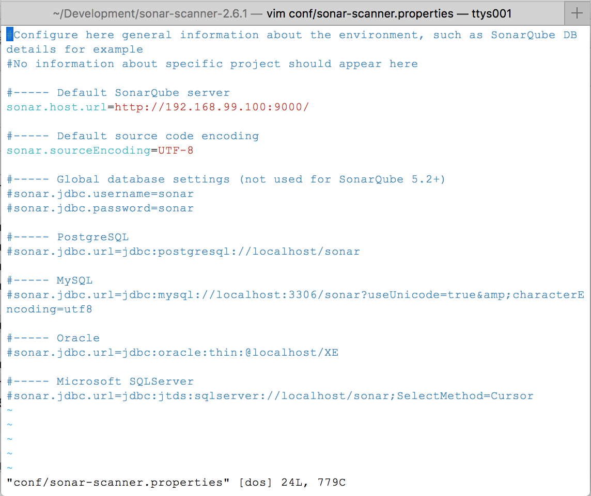

## QUICK SETUP

### Get the source code from git
You’ll find the git repository for this project on cronos private git provider.
https://git.cronos.be/i8c/codequality

First step is to clone this repository to your local machine.


Open eclipse and import the sonar-flows-plugin and sonar-flow-plugin-sslr maven projects.


Build the webMethods flow-code plugin jar which we will add as a plugin to the sonarqube server. The generated jar is located under the target directory.


### Start the sonarqube server with docker kitematic 
For this we will use the sonarqube docker image from the docker hub. More info about this images can be found here: https://hub.docker.com/_/sonarqube/
Simply search the sonarqube image and click create. This will pull the sonarqube docker image from the docker hub and start it. 


The server is now up and running. Next you’ll need to copy the webMethods-plugin jar you just created into the volume /opt/sonarqube/extensions.

The sonarqube server is now ready to receive code to analyse from the sonarqube-scanners

### Get the sonarqube scanner
https://sonarsource.bintray.com/Distribution/sonar-scanner-cli/sonar-scanner-2.6.1.zip
Unzip the file somewhere on your machine. This contains the scripts which will analyse your code. Optionally you can add the bin folder to your path.


Configure the conf/sonar-scanner.properties file to point to you’re server. For now leave the other configurations untouched.

The source code for the sonarqube scanner cli can be found here: 
https://github.com/Sonarsource/sonar-scanner-cli


### Analyse your code
Go to webMethods IS package you want to validate. Create a property file named "sonar-project.properties"

See following example
```properties
# must be unique in a given SonarQube instance
sonar.projectKey=flow:testTutorial
# this is the name displayed in the SonarQube UI
sonar.projectName=Development setup tutorial
sonar.projectVersion=1.0
 
# Path is relative to the sonar-project.properties file. Replace "\" by "/" on Windows.
# Since SonarQube 4.2, this property is optional if sonar.modules is set. 
# If not set, SonarQube starts looking for source code from the directory containing 
# the sonar-project.properties file.
sonar.sources=./ns
 
# Encoding of the source code. Default is default system encoding
#sonar.sourceEncoding=UTF-8

sonar.flow.ignore.toplevel=false
``` 

Now just call the sonarqube-scanner script from inside this folder.
 
