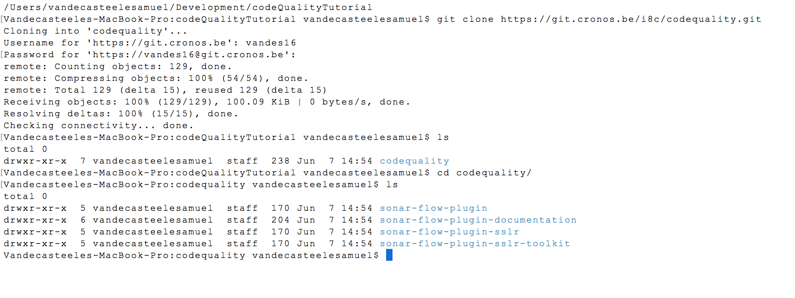
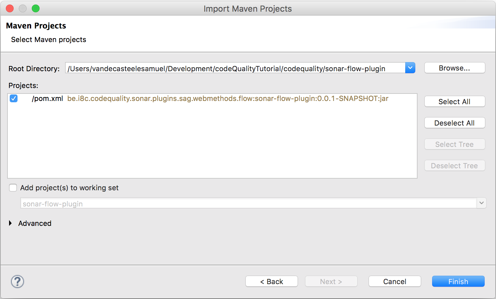
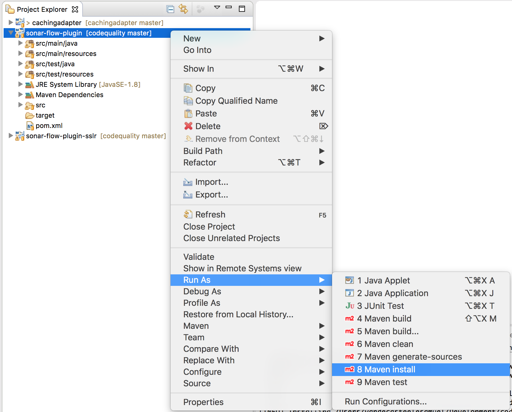
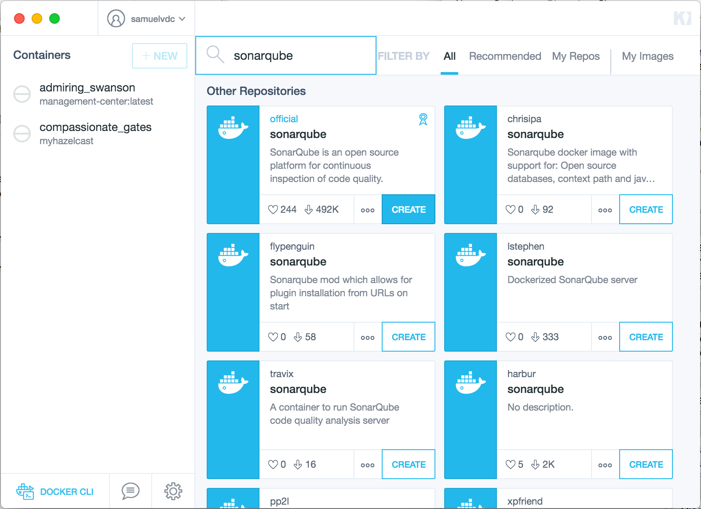
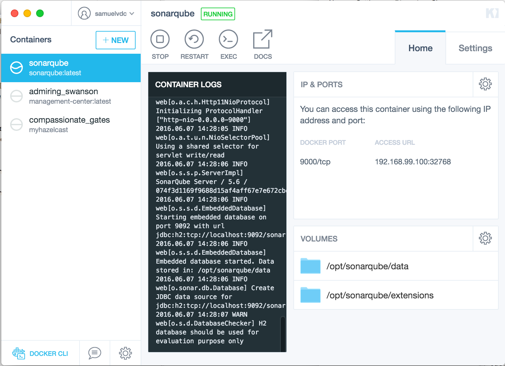
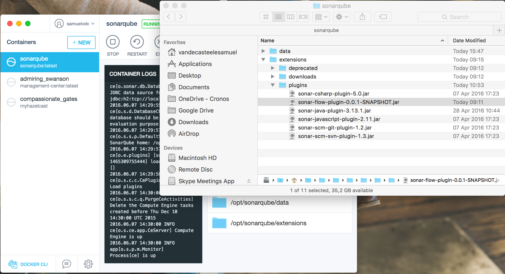
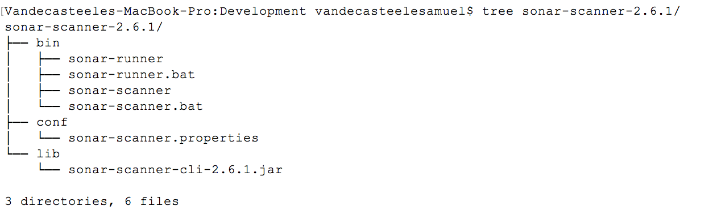
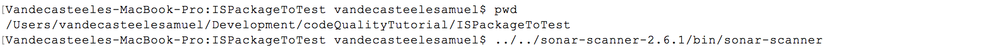

## QUICK SETUP

### 1 Get the source code from git
First step is to clone this repository to your local machine.


Open eclipse and import the sonar-flows-plugin and sonar-flow-plugin-sslr maven projects.


Build the webMethods flow-code plugin jar which we will add as a plugin to the sonarqube server. The generated jar is located under the target directory.


### 2 Start the sonarqube server with docker kitematic 
For this tutorial we will use the sonarqube docker image from the docker hub. More info about this images can be found on: https://hub.docker.com/_/sonarqube/
In kitematic simply search the sonarqube image and click create. This will pull the sonarqube docker image from the docker hub and start it. 


Notice the access URL in the description. This will open the sonarqube dashboard.

The server is now up and running. Next copy the webMethods-plugin-jar from step 1 into the volume /opt/sonarqube/extensions.

The sonarqube server is now ready to receive webMethods-flow code to analyse from the sonarqube-scanners

### 3 Get the sonarqube scanner
The scanner can be downloaded from:
https://sonarsource.bintray.com/Distribution/sonar-scanner-cli/sonar-scanner-2.6.1.zip

Unzip the file somewhere on your machine. This contains the scripts which will send your code to the server. Optionally you can add the bin folder to your path.


Configure the conf/sonar-scanner.properties file to point to your sonarqube-server.
See following example of a "sonar-scanner.properties" file:
```text
#Configure here general information about the environment, such as SonarQube DB details for example
#No information about specific project should appear here

#----- Default SonarQube server
sonar.host.url=http://192.168.99.100:9000/

#----- Default source code encoding
sonar.sourceEncoding=UTF-8

#----- Global database settings (not used for SonarQube 5.2+)
#sonar.jdbc.username=sonar
#sonar.jdbc.password=sonar

#----- PostgreSQL
#sonar.jdbc.url=jdbc:postgresql://localhost/sonar

#----- MySQL
#sonar.jdbc.url=jdbc:mysql://localhost:3306/sonar?useUnicode=true&amp;characterEncoding=utf8

#----- Oracle
#sonar.jdbc.url=jdbc:oracle:thin:@localhost/XE

#----- Microsoft SQLServer
#sonar.jdbc.url=jdbc:jtds:sqlserver://localhost/sonar;SelectMethod=Cursor
```


### 4 Analyse your code
Go to webMethods IS package you want to validate. Create a property file named "sonar-project.properties" in this directory


See following example of a "sonar-project.properties" file:
```
# must be unique in a given SonarQube instance
sonar.projectKey=flow:testTutorial
# this is the name displayed in the SonarQube UI
sonar.projectName=Development setup tutorial
sonar.projectVersion=1.0
 
# Path is relative to the sonar-project.properties file. Replace "\" by "/" on Windows.
# Since SonarQube 4.2, this property is optional if sonar.modules is set. 
# If not set, SonarQube starts looking for source code from the directory containing 
# the sonar-project.properties file.
sonar.sources=./ns
 
# Encoding of the source code. Default is default system encoding
#sonar.sourceEncoding=UTF-8

sonar.flow.ignore.toplevel=false
``` 

Now just call the sonarqube-scanner script from inside this folder.
 

Open your browser go to the url of you sonarqube server. In this example http://192.168.99.100:9000/

There you'll see the results of the flow validation


