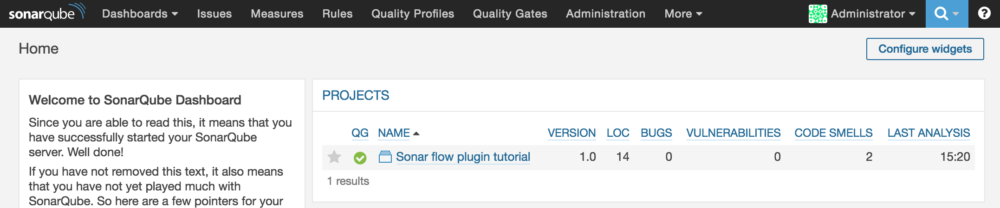
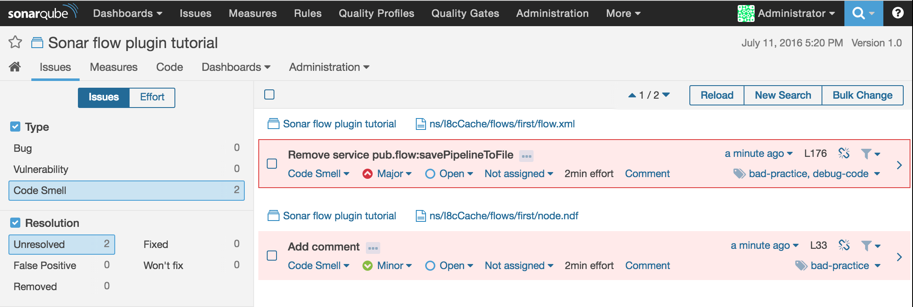

# Quick setup

Download the sonar-flow-plugin jar to your working directory. The jar can be found on the GitHub [release page](https://github.com/I8C/sonar-flow-plugin/releases).

```sh
wget https://github.com/I8C/sonar-flow-plugin/releases/download/v1.0/sonar-flow-plugin-1.0.jar
```
## Install the plugin on the SonarQube server

To install this plugin just add the downloaded jar to your SonarQube server in the plugins folder `/opt/sonarqube/extensions/plugins/`. You will need to restart your server.

### (Optional) Create a SonarQube server with flow plugin using docker

If you do not have a SonarQube server, you can quickly create one using docker. For this part we will use the sonarqube docker image from the docker hub and add the sonar-flow-plugin jar to it. More info about this image can be found on: https://hub.docker.com/_/sonarqube/

Create a folder and download the [dockerfile](https://github.com/I8C/sonar-flow-plugin/blob/master/Dockerfile)

Create a the structure sonar-flow-plugin/target inside your folder and put the downloaded in the target folder.
Next is to build this container and run it using following commands from the Dockerfile location:

```sh
docker build . -t i8c/sonarqube-flow
docker run --name sonarqube-flow -p 9000:9000 i8c/sonarqube-flow
```

Now you should have a running SonarQube server with the sonar-flow-plugin installed on port 9000 of your dockerhost.

## Configure the SonarQube Scanner

The documentation for the scanner can be found [here](http://docs.sonarqube.org/display/SCAN/Analyzing+with+SonarQube+Scanner).
Download the scanner to your filesystem and unzip it.

```sh
wget https://sonarsource.bintray.com/Distribution/sonar-scanner-cli/sonar-scanner-cli-3.1.0.1141.zip
unzip sonar-scanner-cli-3.1.0.1141.zip
```

Now configure the SonarQube scanner to point to your SonarQube server. This is done using the config file at `sonar-scanner-cli-3.1.0.1141/conf/sonar-scanner.properties`. The content of this file should look like this:

```
#No information about specific project should appear here

#----- Default SonarQube server
sonar.host.url=http://192.168.99.100:9000/

#----- Default source code encoding
sonar.sourceEncoding=UTF-8
```

## Run the SonarQube Scanner

Go in your filesystem to the webMethods Integration server package you want to check. And make a new file `sonar-project.properties` with following content:

```
# Must be unique in a given SonarQube instance
sonar.projectKey=sonar-flow-tutorial

# this is the name displayed in the SonarQube UI
sonar.projectName=Sonar flow plugin tutorial
sonar.projectVersion=1.0

# Path is relative to the sonar-project.properties file. 
sonar.sources=./ns

# Encoding of the source code. Default is default system encoding
sonar.sourceEncoding=UTF-8
sonar.flow.ignore.toplevel=false
```

And finally run SonarQube Scanner script inside this directory.

```
../sonar-scanner-cli-3.1.0.1141/bin/sonar-scanner
```

## View results

Now go to your browser and go to `http://<your SonarQube host ip>:9000`. Here you'll see that the project "Sonar flow plugin tutorial" has been added and 2 code smells were detected in this Integration server package.


When you look at those 2 issues you'll see that I should have added a comment and removed the savePipeline flow.



