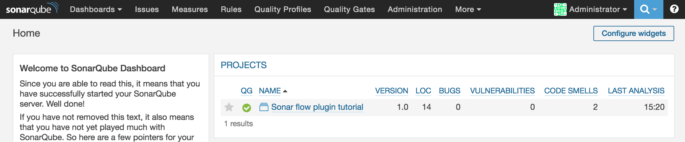
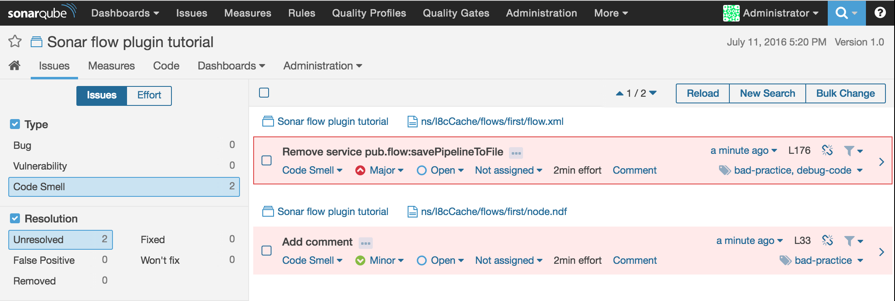

## Quick setup example

For this guide we will use the sonarqube docker image from the docker hub and add the sonar-flow-plugin jar to it. More info about this images can be found on: https://hub.docker.com/_/sonarqube/

Download the sonar-flow-plugin jar to your working directory. The jar can be found on the github release page.

```sh
wget https://github.com/I8C/sonar-flow-plugin/releases/download/v0.1/sonar-flow-plugin-0.1.jar
```
### Install the plugin on the SonarQube server

To install this plugin just add the downloaded jar to your SonarQube server in the plugins folder `/opt/sonarqube/extensions/plugins/`. You will need to restart your server.

#### Create a SonarQube server with flow plugin using docker

In the same directory as the downloaded jar, create a Dockerfile with the following content:

```
FROM sonarqube

COPY ./sonar-flow-plugin-0.1.jar /opt/sonarqube/extensions/plugins
```
This will use the official SonarQube image as base and add the jar to the plugin directory of the sonarqube server.

Next is to build this container and run it using following commands:

```sh
docker build -t i8c/wm-sonarqube .

docker run -d -p 9000:9000 -p 9092:9092 i8c/wm-sonarqube
```

Now you should have a running SonarQube server with the sonar-flow-plugin installed on port 9000 of your dockerhost.

### Configure the SonarQube Scanner

The documentation for the scanner can be found [here](http://docs.sonarqube.org/display/SCAN/Analyzing+with+SonarQube+Scanner).
Download the scanner to your filesystem and unzip it.

```sh
wget https://sonarsource.bintray.com/Distribution/sonar-scanner-cli/sonar-scanner-2.6.1.zip
unzip sonar-scanner-2.6.1.zip
```

Now configure the SonarQube scanner to point to your SonarQube server. This is done using the config file at `sonar-scanner-2.6.1/conf/sonar-scanner.properties`.

```
#No information about specific project should appear here

#----- Default SonarQube server
sonar.host.url=http://192.168.99.100:9000/

#----- Default source code encoding
sonar.sourceEncoding=UTF-8

#----- Global database settings (not used for SonarQube 5.2+)
#sonar.jdbc.username=sonar
#sonar.jdbc.password=sonar

#----- PostgreSQL
#sonar.jdbc.url=jdbc:postgresql://localhost/sonar

#----- MySQL
#sonar.jdbc.url=jdbc:mysql://localhost:3306/sonar?useUnicode=true&amp;characterEncoding=utf8

#----- Oracle
#sonar.jdbc.url=jdbc:oracle:thin:@localhost/XE

#----- Microsoft SQLServer
#sonar.jdbc.url=jdbc:jtds:sqlserver://localhost/sonar;SelectMethod=Cursor
```

### Run the SonarQube Scanner

Go in your filesystem to webMethods Integration server package you want to check. And make a new file `sonar-project.properties` with following content:

```
# must be unique in a given SonarQube instance
sonar.projectKey=sonar-flow-tutorial
# this is the name displayed in the SonarQube UI
sonar.projectName=Sonar flow plugin tutorial
sonar.projectVersion=1.0

# Path is relative to the sonar-project.properties file. 
sonar.sources=./ns

# Encoding of the source code. Default is default system encoding
sonar.sourceEncoding=UTF-8
sonar.flow.ignore.toplevel=false
```

And finally run SonarQube Scanner script inside this directory.

```
../sonar-scanner-2.6.1/bin/sonar-scanner
```

### View results in SonarQube dashboard

Now go to your browser and go to `http://<your docker host ip>:9000`. Here you'll see that the project Sonar "flow plugin tutorial" has been added and 2 code smells were detected in my ISPackage.


When look at those 2 issues we see that we should add a comment and remove the savePipeline flow.



